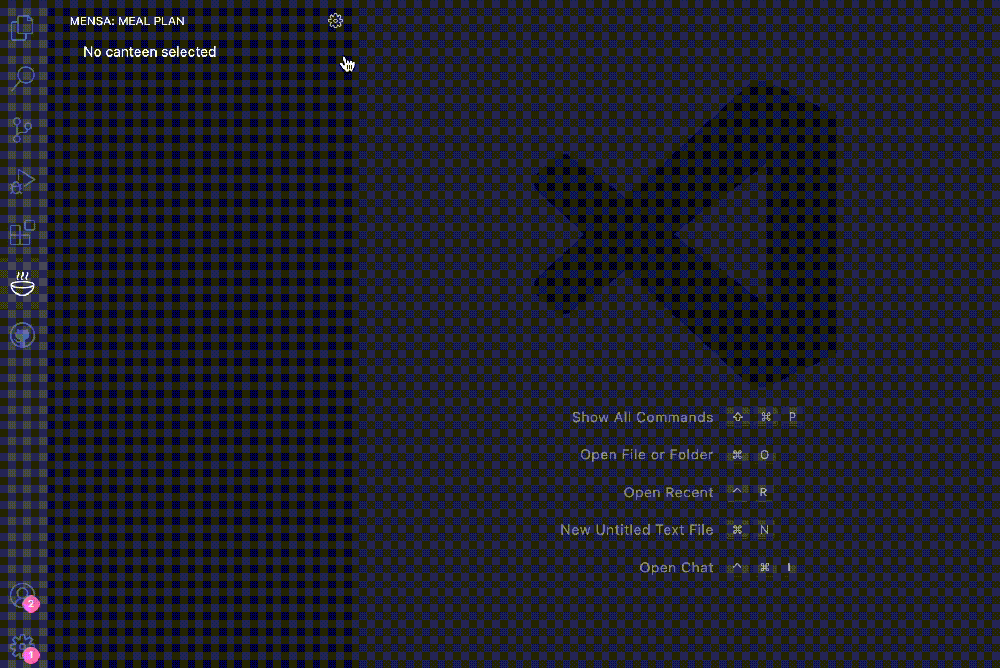

# openmensa-vscode

View daily meal plans from [OpenMensa](https://openmensa.org/).a

## Features

* Quick Access to Canteen Menus: Easily view the daily menus from local cafeterias and canteens without opening a browser.
* Customizable Canteen Selection: Choose your preferred canteen or cafeteria, and switch between them as you like.

## How to Use
1. Access the Menu: Once the extension is installed, a new icon will appear in the Activity Bar (on the left side of VSCode). Click it to open the side bar.
2. Select your Canteen: When you click on the settings icon, you'll see a list of available canteens that can be searched. Please select your preferred canteen.
3. Select the day: Now you’ll see a list of available days in the side bar. Select a day to see the menu for that day.
4. Menu: The menu will be displayed in a new tab. Enjoy your meal!
5. Switch Canteens: Want to check a different cafeteria? You can quickly switch canteens via the settings icon in the extension's side bar.

## FAQs

### Can I use this extension for any canteen?

Probably yes. The extension supports many canteens in Germany and neighbouring countries. You can select your preferred one from the list.

### Is the extension free to use?

Absolutely! The extension is completely free and open-source.

### Does the extension work offline?

No, the extension requires an internet connection to fetch the canteen’s menu from online sources.

## Extension Settings

* `openmensa-vscode.canteenId`: The identifier of your preferred canteen to query the meal plan from [OpenMensa](openmensa-vscode.canteenId).

## Known Issues

## Release Notes

### 1.0.0

Initial release. Watch meal plans for your specified canteen.

## Credits

* This extension queries meal pleans form [OpenMensa](openmensa-vscode.canteenId).
* This extension uses [free icons from Streamline](https://streamlinehq.com/).